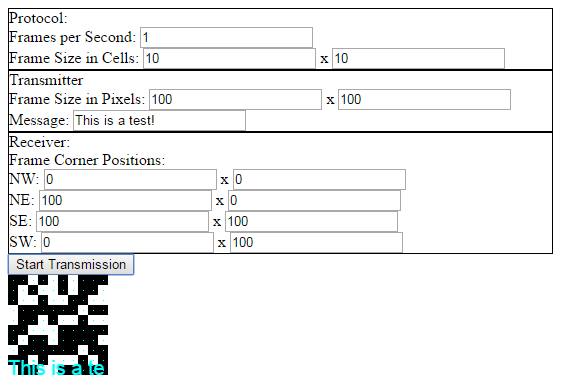

Pixel Matrix Transceiver
========================

A utility to encode a message as a series of pixel matrices,
and to decode the message from that series of pixel matrices.

This is a work in progress.

